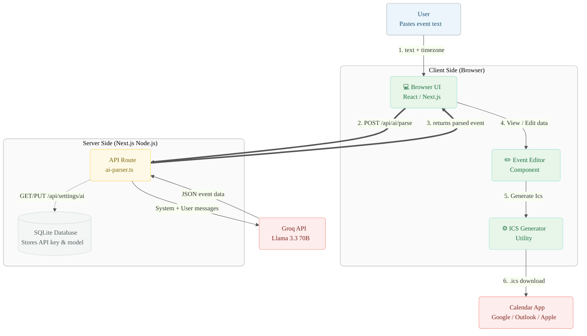
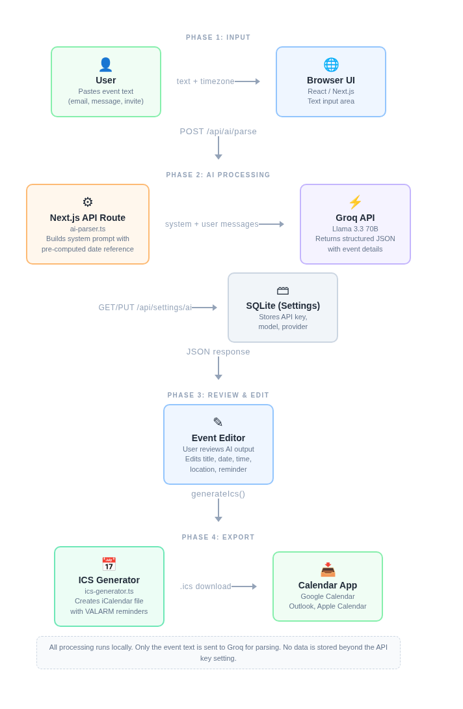

# Event to ICS

**AI-Powered Event Extractor** — Paste an email or message, and let AI extract the event details into a downloadable `.ics` file for Google Calendar, Outlook, or Apple Calendar.

## How It Works




<!--  -->

---

## What the App Does

Event to ICS solves a common problem: you receive an event invitation in an email or chat message, and manually creating a calendar entry is tedious. This app lets you paste the raw text and uses AI (Groq's Llama 3.3 70B) to instantly extract structured event details — title, date, time, location, and duration — then generates a standard `.ics` file you can import into any calendar application.

**Key features:**

- **Natural language parsing** — understands informal text like "let's meet next Tuesday at 2pm for about 30 min"
- **Pre-computed date reference** — the app computes exact calendar dates for the next 7+ days and sends them to the AI, so it never gets weekday arithmetic wrong
- **Timezone-aware** — detects and converts timezone abbreviations (PST, EST, BST, JST, etc.) to UTC
- **Editable output** — review and tweak the AI-extracted details before downloading
- **Confidence scoring** — shows high/medium/low confidence based on how explicit the event details were
- **AI reasoning** — displays the step-by-step reasoning the AI used to interpret the text
- **Dark mode** — toggle between light and dark themes
- **Runs locally** — all processing happens on your machine; only the event text is sent to Groq

---

## What Is Sent to Groq

The app sends **two messages** to the Groq chat completions endpoint (`/chat/completions`):

### 1. System Prompt

A detailed instruction prompt (~100 lines) that tells the AI how to extract events. It includes:

- **Current context** — current UTC time, user's local date, timezone
- **Pre-computed date reference** — exact dates for today, tomorrow, and the next occurrence of every weekday, so the AI doesn't need to calculate dates itself
- **Date resolution rules** — how to handle "next Tuesday", "tomorrow", "in 3 days", etc.
- **Timezone rules** — conversion mappings for US and international timezones
- **Output rules** — the required JSON shape and field descriptions

### 2. User Message

The raw text the user pasted (e.g., an email or chat message). Nothing else is added.

### Example Request

```json
{
  "model": "llama-3.3-70b-versatile",
  "messages": [
    {
      "role": "system",
      "content": "You are an AI scheduling assistant...\n\nCURRENT CONTEXT:\n- Current UTC time: 2026-07-16T02:30:00.000Z\n- Current date: July 16, 2026 (Thursday)\n- User's local timezone: Pacific/Auckland\n\nPRE-COMPUTED DATE REFERENCE:\n- Today (Thursday): July 16, 2026 [2026-07-16]\n- Tomorrow (Friday): July 17, 2026 [2026-07-17]\n- Next Saturday: July 18, 2026 [2026-07-18]\n- Next Sunday: July 19, 2026 [2026-07-19]\n- Next Monday: July 20, 2026 [2026-07-20]\n- Next Tuesday: July 21, 2026 [2026-07-21]\n...\n\nOUTPUT RULES:\nRespond with ONE single JSON object..."
    },
    {
      "role": "user",
      "content": "Hi there,\n\nJust confirming our meeting next Tuesday at 2pm. We'll be on Zoom. Should take about 30 minutes.\n\n— Alex"
    }
  ],
  "temperature": 0.1
}
```

### Example Response

```json
{
  "title": "Meeting with Alex",
  "description": null,
  "location": "Zoom",
  "localDate": "2026-07-21",
  "localTime": "14:00",
  "durationMinutes": 30,
  "startAt": "2026-07-21T02:00:00.000Z",
  "endAt": "2026-07-21T02:30:00.000Z",
  "allDay": false,
  "reminderMinutes": 15,
  "confidence": "high",
  "resolution": "next Tuesday = July 21, 2026",
  "reasoning": "The user said 'next Tuesday at 2pm'. From the pre-computed date reference, next Tuesday = July 21, 2026. Duration is stated as 'about 30 minutes'.",
  "originalTime": "2pm",
  "originalTimezone": null,
  "notes": null
}
```

---

## Installation & Setup

### Prerequisites

- **[Node.js](https://nodejs.org/)** (LTS version recommended)
- A **[Groq API key](https://console.groq.com/keys)** (free)

### Step 1: Extract

Extract the entire folder from the ZIP file. **Do not** run scripts from inside the ZIP.

### Step 2: Install

Open the `app/` folder, then double-click `install.bat`. It will:

1. Check that Node.js is installed
2. Run `npm install` to download dependencies (~300-400 MB)
3. Set up the SQLite database with Prisma
4. Show a success popup when done

### Step 3: Configure

1. Open the `app/` folder, then double-click `start.vbs` to launch the app (the browser opens automatically)
2. Click the **⚙ Settings** button in the top-right corner
3. Paste your **Groq API key** (get one free at [console.groq.com/keys](https://console.groq.com/keys))
4. Optionally change the model (default: Llama 3.3 70B)
5. Click **Save & Exit**

### Step 4: Use

See the UI phases below.

---

## User Interface Phases

### Phase 1: Text Input

The main screen shows a large text area where you paste the event text. You'll see:

- A **status indicator** showing whether the AI is configured (green checkmark or warning)
- A **"Load sample"** button to try a pre-filled example
- A **"Paste from clipboard"** button for quick pasting
- A **"Clear"** button to reset the text area
- A **theme toggle** (light/dark) and a **settings** button in the header

```
┌─────────────────────────────────────────────────┐
│  📅 Event to ICS          [theme] [⚙ Settings]  │
│                                                  │
│  ┌────────────────────────────────────────────┐  │
│  │  Paste your event text here...             │  │
│  │                                             │  │
│  │                                             │  │
│  │                                             │  │
│  └────────────────────────────────────────────┘  │
│                                                  │
│  [Load sample]  [Paste from clipboard]           │
│                                                  │
│           [ 🪄 Extract Event ]                   │
└─────────────────────────────────────────────────┘
```

### Phase 2: AI Processing

After clicking **Extract Event**, the app:

1. Sends the text to the server (`POST /api/ai/parse`)
2. The server builds the system prompt with pre-computed dates and calls Groq
3. A loading spinner shows while waiting for the response
4. The AI's **reasoning** is displayed, explaining how it interpreted the text

### Phase 3: Event Review & Edit

The parsed event appears in an editable form:

- **Title** — auto-filled by AI
- **Date & Time** — start and end date/time pickers
- **All-day** — toggle for all-day events
- **Location** — auto-filled if mentioned in the text
- **Description** — additional details
- **Reminder** — configurable reminder (default: 15 minutes before)
- **Email reminder** — optional email reminder 1 day before
- **Confidence badge** — green (high), amber (medium), red (low)
- **AI Reasoning** — collapsible section showing how the AI interpreted the text

```
┌─────────────────────────────────────────────────┐
│  ✅ Event Extracted                    [high]    │
│                                                  │
│  Title:    [ Meeting with Alex             ]     │
│  Start:    [2026-07-21] [14:00]                 │
│  End:      [2026-07-21] [14:30]                 │
│  Location: [ Zoom                        ]     │
│  Reminder: [15 minutes ▼]  ☐ Email 1 day before │
│                                                  │
│  ▼ AI Reasoning                                  │
│    "The user said 'next Tuesday at 2pm'...       │
│                                                  │
│  [ 📥 Download .ics ]                            │
└─────────────────────────────────────────────────┘
```

### Phase 4: Download

Click **Download .ics** to save the calendar file. The file is named after the event title (e.g., `Meeting_with_Alex.ics`) and can be:

- Double-clicked to open in your default calendar app
- Dragged into Google Calendar
- Attached to an email for the other participant

Closing the browser tab will automatically stop the server after ~15 seconds.

---

## Tech Stack

| Component | Technology |
|-----------|-----------|
| Frontend | Next.js 16, React 19, Tailwind CSS 4, Framer Motion |
| UI Components | Radix UI (shadcn/ui pattern) |
| AI Provider | Groq (Llama 3.3 70B) |
| Database | SQLite via Prisma ORM (stores settings only) |
| Calendar Format | iCalendar (RFC 5545) with VALARM reminders |
| Theme | next-themes (light/dark mode) |

---

## Privacy

- All processing runs **locally** on your machine
- Only the **event text** is sent to Groq for parsing — nothing else
- The Groq API key and model preference are stored in a **local SQLite database**
- No analytics, no telemetry, no external tracking
- The server process stops automatically when you close the browser tab

---

## Project Structure

```
event-to-ics/
├── README.md
├── LICENSE
├── .gitignore
├── docs/
│   └── architecture-diagram.png
└── app/                       ← All application code
    ├── package.json
    ├── install.bat
    ├── start.vbs
    ├── prisma/
    ├── public/
    └── src/
        ├── app/
        ├── components/
        └── lib/
```

---

## License

MIT
